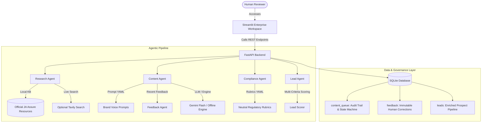
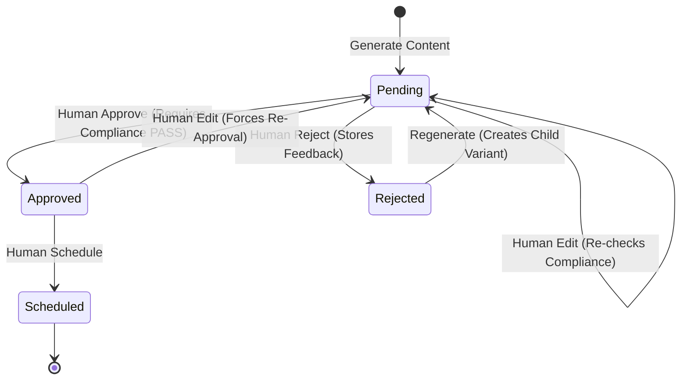

# JA Assure AI Marketing Agent — Technical Architecture

## 1. System Overview

The JA Assure AI Marketing Agent is an InsurTech-specialized agentic marketing system designed for regulated insurance entities operating across Southeast Asia. The system supports two distinct brands under JA Assure:

- **Jade**: High-value asset, luxury jewellery, fine art, and commercial Jewellers Block & Specie insurance.
- **DoctorShield**: Healthcare professional indemnity, medical malpractice litigation defense financing, and statutory council (SMC/MMC) inquiry representation.

The platform enforces strict regulatory compliance gating, human-in-the-loop sign-off, and closed-loop learning from human reviewer feedback.

---

## 2. Core Architectural Components

### 2.1 Backend Services (FastAPI)
- **Host & Port:** `127.0.0.1:8000`
- **Lifespan Manager:** Initializes SQLite schema on boot, verifies foreign keys and WAL mode.
- **CORS:** Configured for local Streamlit integration (`localhost:8501`).
- **Endpoints:**
  - `GET /health`: Health status, active LLM availability, and vector knowledge statistics.
  - `POST /knowledge/ingest-pdfs`: Ingest and index all PDFs from `data/knowledge/pdfs/` into ChromaDB.
  - `GET /knowledge/library`: Query indexed PDF documents and page chunks.
  - `POST /knowledge/retrieve`: Hybrid semantic + keyword retrieval of Tier 1 knowledge.
  - `POST /content/research`: 3-Tier knowledge retrieval and competitor positioning analysis.
  - `POST /content/generate`: Multi-tier prompt assembly via Groq/Gemini with automated risk audit.
  - `POST /content/{id}/approve`: Human review sign-off (strictly requires compliance PASS).
  - `POST /content/{id}/reject`: Human rejection with category tag, note, and automatic embedding into ChromaDB.
  - `POST /content/{id}/edit`: Human direct edit with automated re-audit and status reset to pending.
  - `POST /content/{id}/schedule`: Transition approved asset to scheduled state.
  - `POST /content/{id}/regenerate`: Feedback-driven regeneration linking parent/child assets.
  - `GET /analytics/dashboard`: Centralized operational metrics.
  - `GET /analytics/risk-heatmap`: Dynamic Risk Heatmap matrix (Issue Types x Brands/Platforms).
  - `GET /analytics/top-issues`: Top recurring compliance violations.
  - `GET /analytics/risk-distribution`: Content distribution across LOW, MEDIUM, and HIGH risk.
  - `GET /analytics/rejection-rate`: Multi-cycle review trend metrics.
  - `POST /feedback/semantic-search`: Semantic search across historical reviewer corrections.
  - `POST /competitors/research`: Tier 3 competitor messaging and positioning extraction.
  - `POST /leads/discover`: Lead Agent prospect discovery and multi-criteria scoring.

### 2.2 Local Vector Store & RAG Engine (ChromaDB)
- **Local Persistence:** `data/knowledge/chroma_db/`
- **Embedding Function:** `FastLocalEmbeddingFunction` (256-dimensional L2-normalized domain-weighted subword embeddings; operates 100% offline with zero external model download dependencies).
- **Isolated Collections:**
  1. `company_knowledge`: Tier 1 authoritative JA Assure PDF chunks with exact metadata (`document_id`, `filename`, `page_number`, `section`, `product`, `brand`).
  2. `feedback_embeddings`: Tier 2 reviewer corrections and rejections used for pre-generation negative constraint matching.
- **Hybrid Search:** Blends dense vector cosine similarity with keyword/BM25 token frequency and brand alignment boost.

### 2.2 Storage & Database Isolation (SQLite)
- **Production / Active Database:** `data/ja_assure.db`
- **Demo Workspace Database:** `data/demo/ja_assure_demo.db`
- **Configuration Switch:** `DEMO_MODE=true` environment variable directs execution to the isolated demo database.
- **Tables:**
  - `content_queue`: Contains all marketing assets with complete lifecycle state machine, generation metadata, parent-child links, and grounding citations.
  - `feedback`: Immutable audit log of human reviewer rejections and edit notes.
  - `leads`: Enriched prospect records with source attribution and criteria-driven fit scores.

### 2.3 Knowledge Layer (JA Assure Official Resources)
Grounding material extracted from [https://www.ja-assure.com/resources.html](https://www.ja-assure.com/resources.html):
1. **Jewellers Block and Specie Insurance**: Commercial trade coverage across showrooms, vaults, transit, and trade exhibitions.
2. **Medical Indemnity Insurance**: Dual-function defense financing and patient compensation mechanism under claims-made principles.
3. **The Architecture of Uncertainty**: Foundations of insurance, law of large numbers, insurable interest, and indemnity principle.
4. **The Insurance Ecosystem**: Lloyd's syndicates, coverholder agreements, MGAs, and reinsurance capital structures.
5. **The World of Insurance**: Specialty risk classes and technological distribution.

---

## 3. Human Governance & State Machine

The platform strictly enforces the following state transitions:

### Governance Invariants:
1. **No Agent Direct-to-Approved Path:** No asset can be created directly as `approved` or `scheduled`.
2. **No Failed Compliance Approval:** `approve_content()` strictly enforces `compliance_result.status == "pass"`.
3. **Edit Forces Re-Audit:** Any modification to content text automatically reruns the Compliance Agent and forces status to `pending`.
4. **Immutable History:** Assets are never deleted on regeneration; new variants link to `parent_id` with generation metadata preserved.
