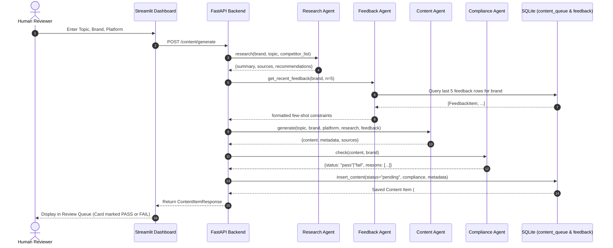
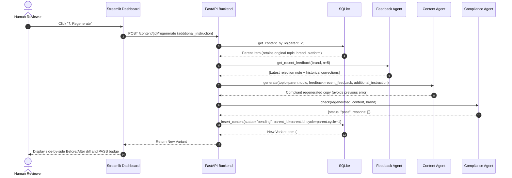
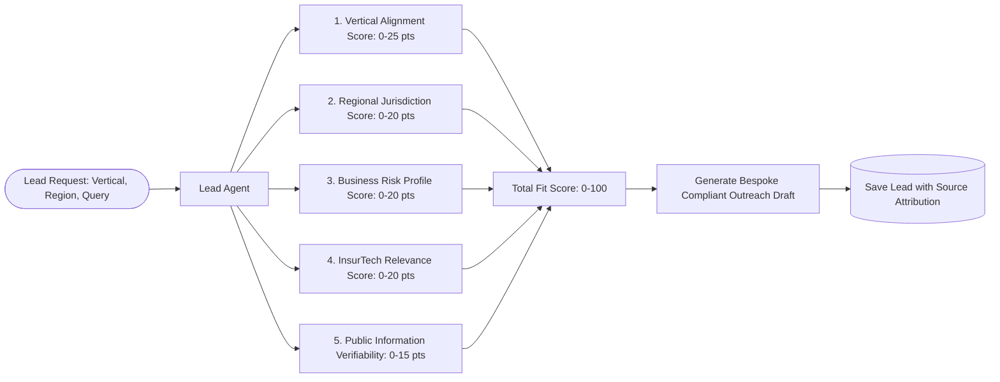

# JA Assure AI Marketing Agent — Data Flow Specification

## 1. End-to-End Generation & Review Flow

The diagram below details the sequence of data transformations from initial brief entry to final scheduling:



---

## 2. Human Rejection & Stored Feedback Flow

When an asset is flagged for non-compliance or off-brand tone:

```mermaid
sequenceDiagram
    autonumber
    actor Reviewer as Human Reviewer
    participant UI as Streamlit Dashboard
    participant API as FastAPI Backend
    participant DB as SQLite (content_queue & feedback)

    Reviewer->>UI: Click "✕ Reject" with tag and note
    UI->>API: POST /content/{id}/reject {tag, note}
    API->>DB: UPDATE content_queue SET status='rejected' WHERE id={id}
    API->>DB: INSERT INTO feedback (content_id, brand, tag, note)
    DB-->>API: Confirmation
    API-->>UI: Updated Content Item (status: rejected)
    UI-->>Reviewer: Shows rejection confirmed; feedback stored immutably
```

---

## 3. Closed-Loop Feedback-Driven Regeneration Flow

When a rejected item is regenerated:



---

## 4. Centralized Analytics & Real Metric Derivation

Every metric displayed on the dashboard is computed directly from SQLite records:

| Metric | SQL / Computation Formula | Empty DB Behavior |
|---|---|---|
| `pending_count` | `SELECT COUNT(*) FROM content_queue WHERE status = 'pending'` | `0` |
| `approved_count` | `SELECT COUNT(*) FROM content_queue WHERE status = 'approved'` | `0` |
| `rejected_count` | `SELECT COUNT(*) FROM content_queue WHERE status = 'rejected'` | `0` |
| `scheduled_count` | `SELECT COUNT(*) FROM content_queue WHERE status = 'scheduled'` | `0` |
| `total_assets` | `SELECT COUNT(*) FROM content_queue` | `0` |
| `total_feedback` | `SELECT COUNT(*) FROM feedback` | `0` |
| `overall_rejection_rate` | `(rejected_count / total_reviewed) * 100` | `0.0%` |
| `latest_cycle` | `SELECT MAX(cycle) FROM content_queue` | `None` / `0` |
| `latest_cycle_rejection_rate` | Rejection rate of `MAX(cycle)` | `0.0%` ("No data") |
| `relative_error_reduction` | `((c1_rate - latest_rate) / c1_rate) * 100` if `cycles >= 2` and `c1_rate > 0` | `"N/A"` |
| `knowledge_source_count` | `len(load_all_sources())` | `5` |
| `lead_count` | `SELECT COUNT(*) FROM leads` | `0` |

---

## 5. Lead Agent Scoring Criteria Pipeline

The Lead Agent evaluates potential prospects using five explicit, normalized dimensions:



- **Rule:** If live research yields no verifiable public listings, no fabricated contact is generated.
