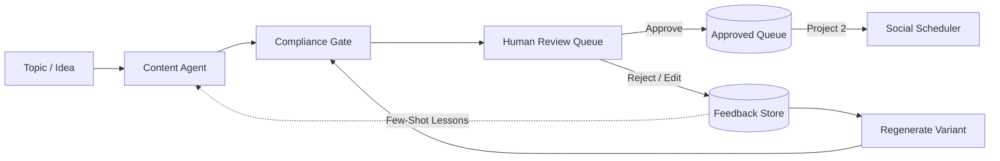

# JA Assure — AI Marketing Agent ("The Brain")

An agentic AI marketing system built for regulated InsurTech brands (operating across Singapore, Malaysia, and Southeast Asia under MAS guidelines). The system generates brand-tailored marketing assets, checks every piece against brand-specific insurance compliance rubrics, enforces strict human-in-the-loop governance, and closes the feedback loop by learning from past reviewer rejections to measurably reduce rejection rates over time.

---

## 1. Problem Statement

Marketing insurance is high-risk: a single non-compliant claim (e.g. implied guarantee, overstated coverage, absolute protection promises) creates severe regulatory and legal exposure under MAS and MMC advertising guidelines. Generic AI tools have no memory of past mistakes and no understanding of regulatory boundaries. Marketing teams either avoid AI or manually rewrite every output, destroying AI productivity gains.

## 2. Solution: The Closed-Loop Feedback Engine

JA Assure AI Marketing Agent solves this with an agentic, learning pipeline:



### The Core Value Loop:
1. **Knowledge Grounding**: Research Agent retrieves verified JA Assure knowledge from official resources (`ja-assure.com/resources.html`).
2. **Generate**: Content Agent crafts brand-tailored copy using distinct brand voices (Jade ≠ DoctorShield) under strict anti-hallucination constraints.
3. **Compliance Gate**: Every asset is audited against YAML regulatory rubrics before human review.
4. **Human Review**: Mandatory human governance — no asset can be published without human approval.
5. **Reject / Edit**: Reviewers record structured feedback (`inaccurate_claim`, `too_salesy`, etc.) and notes.
6. **Feedback Store**: Feedback is stored immutably and fed back as few-shot constraints into the prompt.
7. **Regenerate & Prove Learning**: Regenerated output visibly fixes the flagged mistake and passes compliance.
8. **Empirical Learning Metric**: Rejection rate trends down across review cycles (80% ➔ 60% ➔ 40% ➔ 20%).

---

## 3. Brand Personas & Visual Differentiation

| Brand | Vertical | Voice & Persona | Visual Identity | Official Grounding Source |
|---|---|---|---|---|
| **Jade** | High-Value Jewelry, Luxury Assets & Private Wealth | Refined, sophisticated, discreet, reassuring. Focus on heirloom safeguarding, vault/transit protection. | **Gold Accent** (`#D4AF37`) | [Jewellers Block & Specie Insurance](https://www.ja-assure.com/blog-jewellers-block.html) |
| **DoctorShield** | Medical Malpractice & Healthcare Professional Indemnity | Clinical, authoritative, collegial, peer-to-peer, calm. Focus on medico-legal defense and clinical governance. | **Teal Accent** (`#0D9488`) | [Medical Indemnity Insurance](https://www.ja-assure.com/blog-medical-malpractice.html) |

---

## 4. Tech Stack

- **Backend**: Python 3.10+ + FastAPI
- **Database**: SQLite with Foreign Keys, WAL mode & immutable feedback tables
- **Knowledge Layer**: Lightweight keyword & brand affinity retriever grounded in official JA Assure Resources (`ja-assure.com/resources.html`)
- **Frontend Dashboard**: Streamlit with custom InsurTech CSS theme
- **LLM**: Google Gemini Flash via Google AI Studio API (`GEMINI_API_KEY`)
- **Offline / Local Demo Engine**: Deterministic fallback generator so the hackathon demo never fails even offline
- **Agent Orchestration**: Modular Python agents (`ResearchAgent`, `ContentAgent`, `ComplianceAgent`, `FeedbackAgent`)
- **Compliance Rules**: External YAML files (`rubrics/jade.yaml`, `rubrics/doctorshield.yaml`)
- **Testing**: Pytest with automated 25-test verification suite

---

## 5. Project Structure

```
ja-assure/
│
├── backend/
│   ├── __init__.py
│   ├── main.py                  # FastAPI REST API endpoints
│   ├── database.py              # SQLite connection & schema initialization
│   ├── models.py                # CRUD operations & governance state machines
│   ├── schemas.py               # Pydantic request/response schemas
│   ├── gemini_service.py        # Gemini client with fallback handling
│   ├── knowledge/
│   │   ├── __init__.py
│   │   ├── ja_assure_sources.py # Source definitions and article loaders
│   │   └── knowledge_retriever.py # Lightweight keyword/brand retriever
│   └── agents/
│       ├── __init__.py
│       ├── research_agent.py    # Grounds topics in official JA Assure resources
│       ├── content_agent.py     # Brand/platform prompt generator with anti-hallucination rules
│       ├── compliance_agent.py  # YAML rubric evaluator with exact rule identification
│       └── feedback_agent.py    # Feedback store query and analytics calculator
│
├── dashboard/
│   ├── __init__.py
│   ├── app.py                   # Streamlit InsurTech review dashboard
│   └── style.py                 # Custom CSS (Jade Gold #D4AF37, DoctorShield Teal #0D9488)
│
├── data/
│   └── knowledge/               # Verified JA Assure knowledge extracts
│       ├── jewellers_block.json
│       ├── medical_indemnity.json
│       ├── architecture_uncertainty.json
│       ├── insurance_ecosystem.json
│       └── world_of_insurance.json
│
├── rubrics/
│   ├── jade.yaml                # Advertising compliance rules for Jade
│   └── doctorshield.yaml        # Medical indemnity compliance rules for DoctorShield
│
├── prompts/
│   ├── jade.yaml                # Jade brand voice, vocabulary, platform templates
│   └── doctorshield.yaml        # DoctorShield brand voice, vocabulary, platform templates
│
├── scripts/
│   ├── init_db.py               # Database schema initialization script
│   └── seed_demo.py             # Multi-cycle demo dataset (80% -> 20% rejection rate)
│
├── tests/
│   ├── test_database.py         # DB schema, constraints & human approval tests
│   ├── test_compliance.py       # Pass/Fail rule evaluation tests
│   ├── test_feedback_loop.py    # 10-step feedback loop & knowledge grounding tests
│   └── test_api.py              # FastAPI endpoint integration tests
│
├── .env.example                 # Environment variables template (placeholders only)
├── .gitignore                   # Git ignore file (excludes .env and *.db)
├── requirements.txt             # Python dependencies
├── pytest.ini                   # Pytest configuration
├── README.md                    # Comprehensive documentation
└── run_demo.py                  # Unified one-command demo launcher
```

---

## 6. Quickstart & Setup Instructions

### Prerequisites
- Python 3.10+ installed
- Git

### 1. Clone & Install Dependencies
```bash
git clone https://github.com/santosh-1107/JA-Assure--AI-Marketing-agent.git
cd "JA-Assure--AI-Marketing-agent"

pip install -r requirements.txt
```

### 2. Configure Environment (Optional)
Copy `.env.example` to `.env`:
```bash
cp .env.example .env
```
*(Optional)* Add your Gemini API key from Google AI Studio:
```ini
GEMINI_API_KEY=your_google_ai_studio_api_key_here
```
> **Note:** If `GEMINI_API_KEY` is not provided, the system automatically runs in **Deterministic InsurTech Engine (Offline Mode)**, allowing 100% of features and judge demo flows to run smoothly without internet or external API dependencies.

### 3. Initialize & Seed Demo Database
```bash
python scripts/seed_demo.py
```

---

## 7. Running the Application

### Option A: One-Command Unified Launcher (Recommended for Demo)
Runs both the FastAPI backend and the Streamlit dashboard together:
```bash
python run_demo.py
```
- **Streamlit Review Dashboard:** [http://localhost:8501](http://localhost:8501)
- **FastAPI Interactive Swagger Docs:** [http://127.0.0.1:8000/docs](http://127.0.0.1:8000/docs)

### Option B: Run Services Separately

**1. FastAPI Backend:**
```bash
python -m uvicorn backend.main:app --host 127.0.0.1 --port 8000 --reload
```

**2. Streamlit Dashboard:**
```bash
streamlit run dashboard/app.py --server.port 8501
```

---

## 8. Running Automated Tests

Run the full test suite (25 tests covering DB constraints, compliance rubrics, API routes, knowledge grounding, and the closed-loop feedback learning loop):
```bash
pytest tests/ -v
```

To run the exact feedback learning and knowledge grounding suite:
```bash
pytest tests/test_feedback_loop.py -v
```

---

## 9. Hackathon Judge Demonstration Script (2 Minutes)

Follow this exact walkthrough to demonstrate the core value proposition:

1. **Open the Dashboard**: Navigate to [http://localhost:8501](http://localhost:8501). Notice the InsurTech header with Jade Gold and DoctorShield Teal branding.
2. **Review the Pending Queue (Tab 1)**:
   - Observe that non-compliant (`FAIL`) items are highlighted in red and sorted to the top.
   - Expand the compliance warning to see the exact rule triggered (e.g. `NO_GUARANTEED_PAYOUT`).
   - Inspect the **`📚 Grounded in JA Assure Knowledge`** badge and expand **`🔍 View Sources`** to see the official article citation.
3. **Execute 1-Click Judge Demo (Tab 4)**:
   - Select **Brand: Jade**, **Platform: LinkedIn**, **Topic: How jewellery businesses protect high-value inventory**.
   - Click **"🚨 Generate Risky Post (Demo FAIL)"**.
   - Observe the Compliance Gate flag: `FAIL — NO_GUARANTEED_PAYOUT`.
   - Click **"🔍 View Sources"** to inspect official JA Assure Jewellers Block article grounding.
   - Click **"❌ 1-Click Reject (Problematic Claim)"** (Tag: `inaccurate_claim`, Note: *"Cannot promise guaranteed payouts or 100% loss-free protection on jewellery inventory. Must qualify under policy terms and vault security criteria."*).
   - Click **"🔄 1-Click Regenerate with Feedback"**.
   - Notice the regenerated variant immediately receives **`✓ COMPLIANCE PASS`** with qualified policy terms and vault security criteria!
   - Inspect the **`🔬 Judge Verification: Before vs After Learning`** comparison box right on the demo bench.
4. **Inspect the Learning Evidence (Tab 3 - Feedback & Learning Hub)**:
   - View the **Rejection Rate Line Chart**: Show the clear downward trend across cycles (80% ➔ 60% ➔ 40% ➔ 20%).
   - Inspect the **Before & After Showcase**: See the exact side-by-side diff where the problematic phrase ("guaranteed payouts") was replaced with compliant, qualified language ("claims assessment subject to policy terms and conditions").
   - View the **Audit Trail Table** showing the permanent record of reviewer feedback.
5. **Brand Differentiation**:
   - Return to Tab 4, switch **Brand to DoctorShield**, notice the topic updates to medical indemnity, click **"Generate Compliant Post"**.
   - Contrast the clinical, authoritative medical malpractice defense voice with Jade's luxury asset tone.
6. **InsurTech Leads (Tab 5 - P1 Feature)**:
   - View prospective leads across Jewellers and Clinics with fit scores (e.g. 92/100) and tailored outreach drafts. Click **"Mark Sent"** to update status.

---

## 10. Security & Governance Principles

1. **Human-in-the-Loop Governance**: Hard rule enforced at the database layer. No asset can reach `approved` or `scheduled` status without explicit human sign-off.
2. **Secrets Management**: Keys are stored exclusively in `.env` and loaded with `python-dotenv`. `.env` is listed in `.gitignore`.
3. **Audit Trail**: Every generation, rejection, and edit is preserved immutably. Content is never deleted on regeneration; new variants link to `parent_id`.
4. **No Direct Agent-to-Publish Path**: The Content Agent is completely isolated from social publishing mechanisms.
5. **Anti-Hallucination Boundaries**: Official company knowledge from JA Assure Resources is strictly separated from regulatory rules; the agent is prohibited from inventing coverage numbers, guarantees, or market rankings.

---

## 11. Future Scope (P1/P2)

- **Localisation**: Extension to Malay and Bahasa Indonesia with culturally adapted regulatory rubrics.
- **Auto-Publish Worker (Project 2)**: Background worker polling `content_queue` for `status='scheduled'` to post via Ayrshare or Buffer API.
- **Competitor Digest**: Periodic scraping of regional InsurTech ad copy to surface new market angles.
